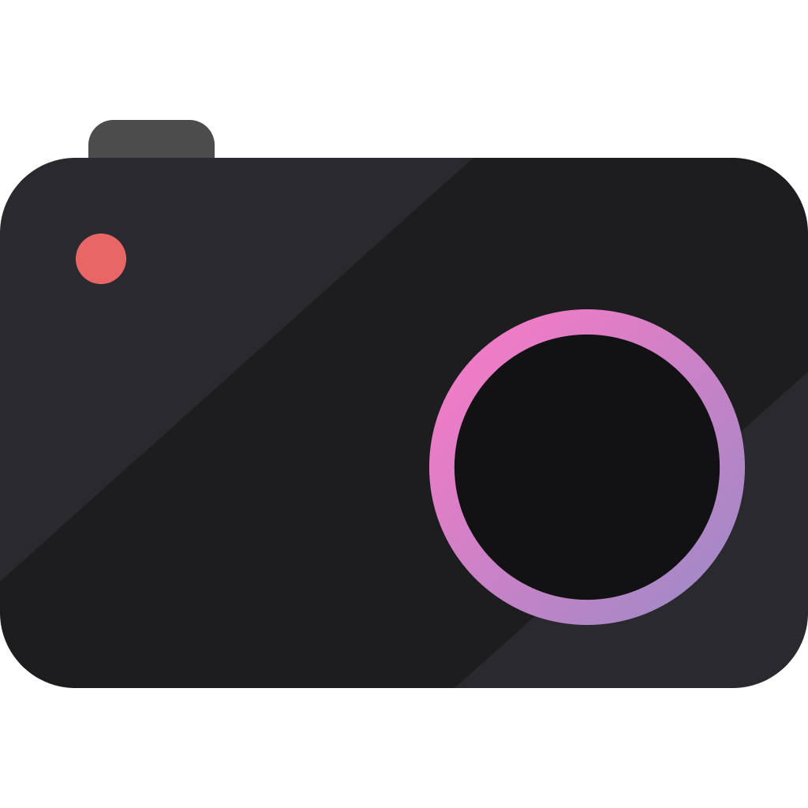
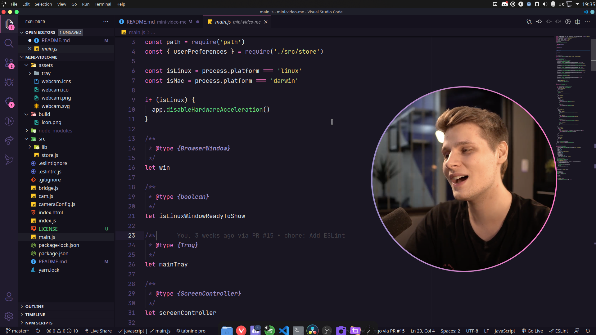

<p align="center">
  
</p>

<h1 align="center">Mini Video Me</h1>
<p align="center">A small webcam player focused on providing an easy way to add and control your webcam during recordings.</p>

<h3 align="center">
  <a href="https://github.com/maykbrito/mini-video-me/actions/workflows/build.yml" target="_blank">
    
  </a>
  <a href="#" target="_blank">
    
  </a>
  <a href="https://twitter.com/maykbrito" target="_blank">
    
  </a>
</h3>

<br />

## Preview

Sample preview running the app:



# Installation

Download the latest version from [releases page](https://github.com/maykbrito/mini-video-me/releases) and run it.

# Usage & settings

After running for the first time you can access the app settings through the tray menu and click on "Settings" to change default shortcuts, camera size, zoom, shapes, etc.

## Default shortcuts

<table>
  <thead>
    <tr>
      <th>Keystroke</th>
      <th>Function</th>
    </tr>
  </thead>
  <tbody>
    <tr>
      <td>+/-</td>
      <td>Zoom in/out (window must be focused)</td>
    </tr>
    <tr>
      <td>/</td>
      <td>Flip horizontal (window must be focused)</td>
    </tr>
    <tr>
      <td>o</td>
      <td>Toggle <a href="#using-custom-shapes">custom shapes</a> (window must be focused)</td>
    </tr>
    <tr>
      <td>r</td>
      <td>Reset zoom (window must be focused)</td>
    </tr>
    <tr>
      <td>Backspace</td>
      <td>Switch cam</td>
    </tr>
    <tr>
      <td>Arrow Up / Down / Left / Right</td>
      <td>Adjust video offset (window must be focused)</td>
    </tr>
    <tr>
      <td>Ctrl+Shift+Alt+Up</td>
      <td>Move camera to upper screen edge</td>
    </tr>
    <tr>
      <td>Ctrl+Shift+Alt+Down</td>
      <td>Move camera to lower screen edge</td>
    </tr>
    <tr>
      <td>Ctrl+Shift+Alt+Right</td>
      <td>Move camera to right screen edge</td>
    </tr>
    <tr>
      <td>Ctrl+Shift+Alt+1</td>
      <td>Set camera size to small</td>
    </tr>
    <tr>
      <td>Ctrl+Shift+Alt+2</td>
      <td>Set camera size to large</td>
    </tr>
    <tr>
      <td>Ctrl+Shift+Alt+3</td>
      <td>Toggle camera visibility</td>
    </tr>
  </tbody>
</table>

> On macOS you can use Command instead of Ctrl.

## Adjust the border

You can **remove border**

Open the camera settings in `tray menu > Settings` and change `"borderWith"` property to `"0"`.

Or you can make it thick by changing the value above to `"10px"` for example.

## Using custom shapes

You can use custom shapes using the [`clip-path`](https://developer.mozilla.org/en-US/docs/Web/CSS/clip-path)
CSS property. You can use a tool like [Clippy](https://bennettfeely.com/clippy/) to play around with different shapes
you can build with `clip-path`.

### How to add/remove shapes

Open the camera settings in `tray menu > Settings` and in the `"shapes"` property, place the CSS's clip-path value as you wish.

<details>
  <summary>See this image example</summary>
  
</details>

## Change size

Open the camera settings in `tray menu > Settings` and change `"screen.initial"` and/or `"screen.large"`'s width and height properties as you wish

<details>
  <summary>See this image example</summary>
  
</details>

# Contributing

Clone de repository, open its folder and install dependencies with:

```sh
yarn
```

Run it using:

```sh
yarn start
```

# Author

👤 **Mayk Brito**

- Twitter: [@maykbrito](https://twitter.com/maykbrito)
- Github: [@maykbrito](https://github.com/maykbrito)
- LinkedIn: [@maykbrito](https://linkedin.com/in/maykbrito)

## Show your support

Give a ⭐️ if this project helped you!
