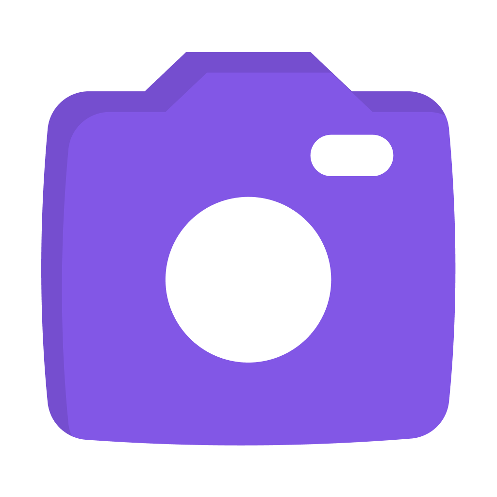

<p align="center">
  
</p>

<h1 align="center">Mini Video Me</h1>
<p align="center">A small webcam player focused on providing an easy way to add and control your webcam during recordings.</p>

<h3 align="center">
  <a href="https://github.com/maykbrito/mini-video-me/actions/workflows/build.yml" target="_blank">
    
  </a>
  <a href="#" target="_blank">
    
  </a>
  <a href="https://twitter.com/maykbrito" target="_blank">
    
  </a>
</h3>

<br />

## Installation

Download the latest version from [releases page](https://github.com/maykbrito/mini-video-me/releases) and run it.

## Running locally

Clone de repository, open its folder and install dependencies with:

```sh
yarn
```

Run it using:

```sh
yarn start
```

## Preview

Sample preview running the app:


## Usage & settings

After running for the first time you can access the app settings through the tray menu and click on "Settings" to change default shortcuts, camera size, zoom, etc.

### Default shortcuts

<table>
  <thead>
    <tr>
      <th>Keystroke</th>
      <th>Function</th>
    </tr>
  </thead>
  <tbody>
    <tr>
      <td>+/-</td>
      <td>Zoom in/out (window must be focused)</td>
    </tr>
    <tr>
      <td>/</td>
      <td>Flip horizontal (window must be focused)</td>
    </tr>
    <tr>
      <td>o</td>
      <td>Toggle rounded camera (window must be focused)</td>
    </tr>
    <tr>
      <td>Arrow Up / Down / Left / Right</td>
      <td>Adjust video offset (window must be focused)</td>
    </tr>
    <tr>
      <td>Ctrl+Shift+Alt+Up</td>
      <td>Move camera to upper screen edge</td>
    </tr>
    <tr>
      <td>Ctrl+Shift+Alt+Down</td>
      <td>Move camera to lower screen edge</td>
    </tr>
    <tr>
      <td>Ctrl+Shift+Alt+Right</td>
      <td>Move camera to right screen edge</td>
    </tr>
    <tr>
      <td>Ctrl+Shift+Alt+1</td>
      <td>Set camera size to small</td>
    </tr>
    <tr>
      <td>Ctrl+Shift+Alt+2</td>
      <td>Set camera size to large</td>
    </tr>
    <tr>
      <td>Ctrl+Shift+Alt+3</td>
      <td>Toggle camera visibility</td>
    </tr>
  </tbody>
</table>

> Inside MacOS you can use Command instead of Ctrl.

## Author

👤 **Mayk Brito**

* Twitter: [@maykbrito](https://twitter.com/maykbrito)
* Github: [@maykbrito](https://github.com/maykbrito)
* LinkedIn: [@maykbrito](https://linkedin.com/in/maykbrito)

## Show your support

Give a ⭐️ if this project helped you!
